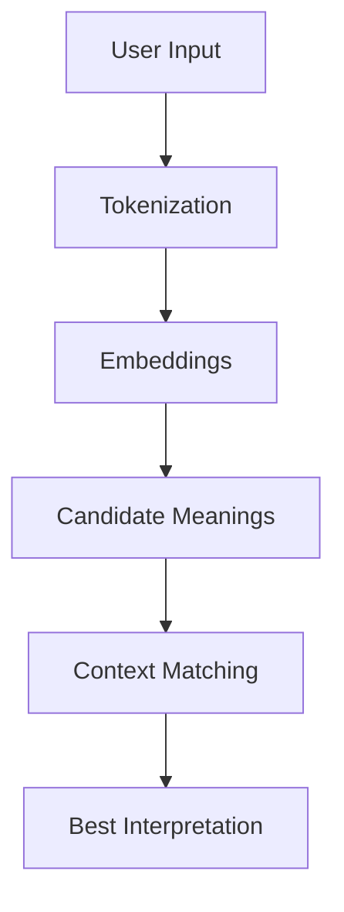

# 01.2.2 NLU Understating Meaning

  <table>
    <tr>
      <td align="center"></td>
      <td align="center"></td>
      <td align="center"></td>
      <td align="center"></td>
    </tr>
  </table>

## 01.2.2.3 Contextual Disambiguation

### <td align="center"> Introduction

Contextual Disambiguation is the process of determining the correct meaning of a word, phrase, or sentence based on its **context**.

In Natural Language Understanding (NLU), many words and sentences are inherently ambiguous. Context allows systems to resolve these ambiguities by analyzing surrounding words, previous conversation turns, and domain knowledge.

Example:

> “I went to the bank.”

- Could mean:
  - Financial institution  
  - River bank  

Only context (e.g., “to deposit money” vs. “to relax near the water”) reveals the correct meaning.

### Types of Ambiguity in Language

Understanding contextual disambiguation requires recognizing different types of ambiguity:

#### 1. Lexical Ambiguity (Word-level)

Words with multiple meanings:

- **Same spelling** → bat, bank, can, present  
- **Same sound** → buy, by, bye | oar, or, ore  
- **Proper nouns** → Jack vs jack | Mark vs mark  

---

#### 2. Semantic Scope Ambiguity (Sentence-level)

Sentences with multiple interpretations:

- **Subject** → “I can see the man with glasses.”  
- **Plurality** → “They only ate the pizza.”  
- **Preposition** → “There’s a dog with a frog on a log.”  

---

#### 3. Contextual Ambiguity (Pragmatic)

Meaning depends on real-world or conversational context:

- **Sarcasm** → “Yay, I get to wait in line.”  
- **Hyperbole** → “This is taking forever.”  
- **Metaphors** → “This place is a zoo.”  
- **Implied meaning** → “Sit tight”, “Go with the flow”  
- **Cultural nuances** → “Y’all”, dialect expressions  

---

#### 4. Evolving Language Ambiguity

Language changes over time:

- **Slang** → cool, groovy, fly, gnarly, phat, fire  
- **Internet slang** → lol, lmao, imo, jk, irl, dm  
- **Emojis** → 🙂 😬 🤔  
- **Technology influence** → “cell phone” (device vs communication context)  

---

### <td align="center"> Why use it?

- Resolve **ambiguity** in language (polysemy & homonyms)  
- Improve **accuracy** of NLU systems  
- Enable **better conversational understanding**  
- Enhance **RAG retrieval relevance**  
- Avoid incorrect actions in automation systems  
- Support multi-turn conversations with evolving meaning  

Without contextual disambiguation, systems may:
- Misinterpret user intent
- Retrieve irrelevant documents
- Execute wrong actions

---
 
### <td align="center"> How it works?

#### Step-by-step Process

1. **Input Processing**
   - Tokenization and embeddings generation

2. **Context Gathering**
   - Sentence-level context  
   - Conversation history  
   - External knowledge (documents, KBs)

3. **Candidate Meanings**
   - Identify possible interpretations for ambiguous terms

4. **Context Matching**
   - Compare candidates against context using embeddings or probabilistic models

5. **Selection**
   - Choose the most likely meaning

#### Example Flow

     
---

### <td align="center"> Components

**1. Context Sources**
- Surrounding words (local context)  
- Previous messages (conversation context)  
- External knowledge bases  

**2. Word Sense Disambiguation (WSD)**
- Core technique to select the correct meaning of a word  

**3. Embeddings & Similarity**
- Semantic similarity used to match meaning with context  

**4. Attention Mechanisms (Transformers)**
- Focus on relevant parts of the input sequence  

**5. Memory / State Tracking**
- Maintains conversation continuity  

---

### <td align="center"> Use Cases

- Chatbots & Virtual Assistants  
- Multi-turn Conversations  
- Search Query Understanding  
- RAG Systems (better document retrieval)  
- Machine Translation  
- Voice Assistants  
- Recommendation Systems

---

###  Videos

A few recommended resources to visualize:

  

---

  

---

  

