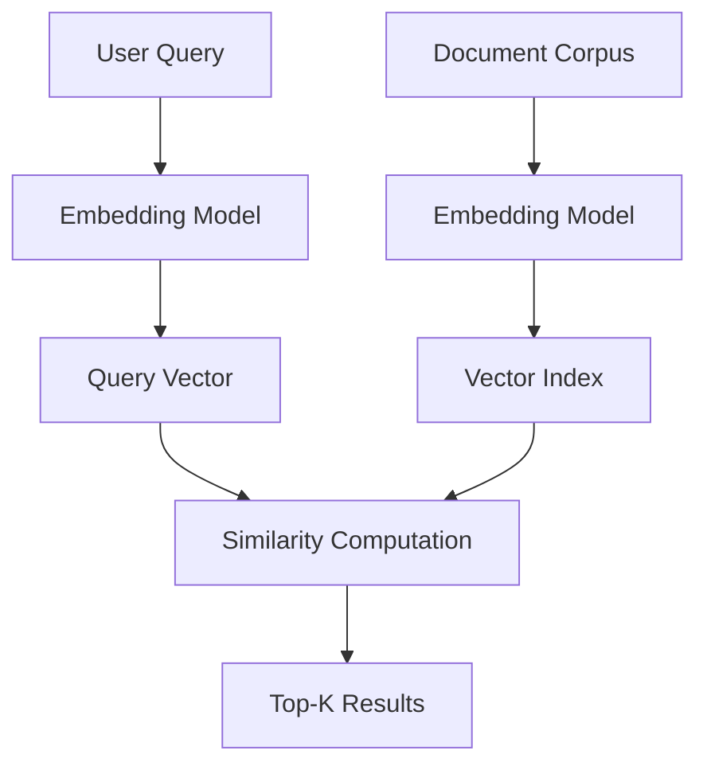

# 02.2. NLU Understanding Meaning

  <table>
    <tr>
      <td align="center"></td>
      <td align="center"></td>
      <td align="center"></td>
      <td align="center"></td>
    </tr>
  </table>

## 02.2.4. Similarity Search

### <td align="center"> Introduction

**Similarity Search** is the process of finding items (documents, sentences, vectors) that are **most similar** to a given query, based on their semantic meaning rather than exact keyword matching.

In Natural Language Understanding (NLU) and [RAG Pipelines](https://github.com/gil-son/language-ai-engineering-lab/tree/main/06-RAG-Pipeline) – retrieve the most relevant document chunks for LLM context, similarity search bridges the gap between a user's query and relevant stored knowledge by comparing vector representations (embeddings) in a high-dimensional space.

Example:

> Query: "How do I reset my password?"

- Similarity search may return:
  - "Steps to recover your account credentials"
  - "Forgot password guide"
  - "Account access troubleshooting"

Even though none of these contain the exact words, they are **semantically close** to the original query.

---

### <td align="center"> Why use it?

- Find **semantically relevant** results beyond keyword matching
- Power [**RAG Pipelines**](https://github.com/gil-son/language-ai-engineering-lab/tree/main/06-RAG-Pipeline) – retrieve the most relevant document chunks for LLM context by retrieving the most relevant context chunks
- Enable **semantic search** in knowledge bases and document stores
- Support **recommendation systems** (similar products, articles, users)
- Improve **question answering** by locating the best matching passages
- Handle **paraphrases and synonyms** naturally
- Scale to **millions of documents** efficiently with approximate methods

Without similarity search, systems rely on brittle keyword matching that fails when users rephrase queries or use synonyms.

---

### <td align="center"> How it works?

#### Step-by-step Process

1. **Embedding Generation**
   - Convert text (query and documents) into dense vector representations using an embedding model (e.g., sentence-transformers, OpenAI embeddings)

2. **Index Construction**
   - Store document vectors in a vector index (flat, IVF, HNSW, etc.) for efficient retrieval

3. **Query Encoding**
   - Encode the incoming user query into a vector using the same embedding model

4. **Distance / Similarity Computation**
   - Measure similarity between the query vector and all indexed vectors using a distance metric:
     - **Cosine Similarity** – angle between vectors (most common for text)
     - **Dot Product** – useful when vectors are normalized
     - **Euclidean Distance (L2)** – geometric distance in vector space

5. **Ranking & Retrieval**
   - Return the top-K most similar documents ranked by score

#### Example Flow

#### Distance Metrics

| Metric | Formula | Best For |
|--------|---------|----------|
| Cosine Similarity | cos(θ) = (A·B) / (‖A‖ ‖B‖) | Text, normalized vectors |
| Dot Product | A·B | Normalized embeddings |
| Euclidean (L2) | √Σ(Aᵢ - Bᵢ)² | Dense numerical data |

---

### <td align="center"> Components

**1. Embedding Model**
Converts text into fixed-size dense vectors that capture semantic meaning.
- Examples: `sentence-transformers`, `text-embedding-ada-002`, `BAAI/bge-*`

**2. Vector Store / Index**
Stores and organizes vectors for fast retrieval.
- **Exact (Flat Index):** brute-force comparison; precise but slow at scale
- **Approximate Nearest Neighbor (ANN):** HNSW, IVF; faster but approximate
- Popular stores: FAISS, Pinecone, Weaviate, Chroma, Qdrant, pgvector

**3. Similarity / Distance Metric**
The function used to measure how close two vectors are.
- Cosine similarity (most common for NLP tasks)
- Dot product, Euclidean distance

**4. Top-K Retrieval**
Returns the K most relevant results above an optional similarity threshold.

**5. Re-ranking (Optional)**
A second-stage model re-scores the top-K candidates for higher precision.
- Example: Cross-encoder models applied after initial retrieval

---

### <td align="center"> Use Cases

- [**RAG Pipelines**](https://github.com/gil-son/language-ai-engineering-lab/tree/main/06-RAG-Pipeline) – retrieve the most relevant document chunks for LLM context
- **Semantic Search** – go beyond keyword search in enterprise knowledge bases
- **Question Answering** – find the best matching passage for a given question
- **Recommendation Systems** – suggest similar products, articles, or users
- **Duplicate Detection** – identify near-duplicate content in large corpora
- **Chatbot Memory** – retrieve relevant past conversation turns
- **Image & Multimodal Search** – find semantically related images using CLIP-like models
- **Code Search** – find semantically similar code snippets given a natural language description

---

###  Limitations

- Embedding quality depends heavily on the model and domain
- Approximate methods (ANN) trade accuracy for speed
- High-dimensional vectors require significant memory and storage
- Semantic search may surface plausible-but-incorrect results (hallucination risk in RAG)
- Cross-lingual similarity requires multilingual embedding models
- Embedding drift when documents and queries use different vocabulary styles

---

###  Code / Notebook / Projects

- [NLP, NLU, NLG with RAG - Make Matthew notebook from bible](https://github.com/gil-son/llm-engineering-lab/tree/main/notebooks/02-NLP-NLU-NLG)

---

###  Videos

A few recommended resources to visualize:

  

---

  

