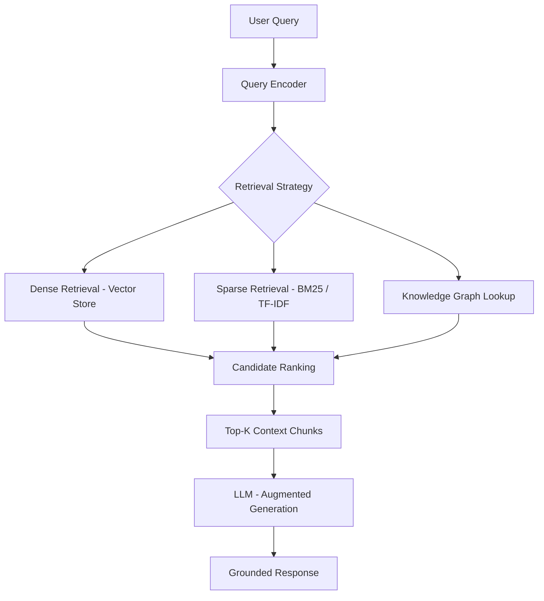

# 01.2.2 NLU Understanding Meaning

  <table>
    <tr>
      <td align="center"></td>
      <td align="center"></td>
      <td align="center"></td>
      <td align="center"></td>
    </tr>
  </table>

## 01.2.2.5 Knowledge Retrieval

### <td align="center"> Introduction

**Knowledge Retrieval** is the process of finding and extracting relevant information from a structured or unstructured knowledge source in response to a query.

In Natural Language Understanding (NLU) and [RAG Pipelines](https://github.com/gil-son/language-ai-engineering-lab/tree/main/06-RAG-Pipeline), knowledge retrieval is the critical step that connects a user's intent to the information needed to generate an accurate, grounded response. It goes beyond simple similarity search by incorporating knowledge organization strategies — such as knowledge graphs, document hierarchies, and hybrid retrieval — to surface the most contextually appropriate content.

Example:

> Query: "What are the side effects of ibuprofen?"

- Knowledge Retrieval may pull from:
  - A medical knowledge base (structured)
  - A drug information document corpus (unstructured)
  - A knowledge graph linking `ibuprofen → side_effects → [nausea, headache, ...]`

The system does not generate an answer from scratch — it **retrieves grounded knowledge** to inform and constrain the response.

---

### <td align="center"> Why use it?

- Ground LLM responses in **factual, up-to-date information**
- Reduce **hallucinations** by providing retrieved context to the model
- Enable **domain-specific** question answering without full model retraining
- Connect natural language queries to **structured knowledge sources** (databases, KGs)
- Support **multi-hop reasoning** by chaining retrieved facts
- Scale knowledge without expanding model parameters (retrieval augmentation)
- Allow **knowledge updates** without retraining — just update the knowledge base

Without knowledge retrieval, language models rely solely on parametric memory baked into weights at training time, which is static, potentially outdated, and prone to confabulation.

---

### <td align="center"> How it works?

#### Step-by-step Process

1. **Query Understanding**
   - Parse and encode the user query (intent, entities, embeddings)

2. **Retrieval Strategy Selection**
   - Choose between dense (semantic), sparse (keyword), or hybrid retrieval depending on the use case

3. **Knowledge Source Lookup**
   - Search indexed documents, vector stores, databases, or knowledge graphs

4. **Candidate Ranking**
   - Score and rank retrieved chunks by relevance to the query

5. **Context Assembly**
   - Select and concatenate the top-K results to form the retrieval context

6. **Augmented Generation (in RAG)**
   - Pass retrieved context + original query to the LLM for grounded response generation

#### Example Flow

#### Retrieval Strategies Compared

| Strategy | Method | Strength | Weakness |
|----------|--------|----------|----------|
| Dense Retrieval | Embedding similarity | Handles paraphrases, semantics | Requires embedding model |
| Sparse Retrieval | BM25 / TF-IDF | Fast, interpretable, exact terms | Misses synonyms |
| Hybrid Retrieval | Dense + Sparse combined | Best of both worlds | More complex pipeline |
| Knowledge Graph | Graph traversal | Structured facts, multi-hop | Requires curated KG |

---

### <td align="center"> Components

**1. Knowledge Sources**
The repositories from which information is retrieved:
- **Unstructured:** document corpora, PDFs, web pages, wikis
- **Structured:** relational databases, knowledge graphs, ontologies
- **Semi-structured:** JSON, CSV, Markdown, HTML tables

**2. Indexing Layer**
Organizes knowledge for efficient lookup:
- **Vector Index** (FAISS, Chroma, Pinecone, Qdrant) — for dense retrieval
- **Inverted Index** (Elasticsearch, BM25) — for sparse retrieval
- **Graph Store** (Neo4j, Amazon Neptune) — for knowledge graphs

**3. Retriever**
The component that queries the index and returns candidates:
- **Dense Retriever:** bi-encoder models (e.g., DPR, sentence-transformers)
- **Sparse Retriever:** BM25, TF-IDF
- **Hybrid Retriever:** combines dense + sparse scores (e.g., Reciprocal Rank Fusion)

**4. Re-ranker (Optional)**
A cross-encoder model that re-scores the top-K retrieved candidates for higher precision before passing to the LLM.

**5. Context Assembler**
Selects, deduplicates, and formats the retrieved chunks into a coherent context window for the LLM.

**6. Knowledge Graph (Optional)**
A structured network of entities and relationships enabling multi-hop retrieval:
- `Entity → Relation → Entity`
- Example: `Python → is_a → Programming Language → used_for → Data Science`

---

### <td align="center"> Use Cases

- [**RAG Pipelines**](https://github.com/gil-son/language-ai-engineering-lab/tree/main/06-RAG-Pipeline) — retrieve grounded context for LLM response generation
- **Enterprise Search** — answer employee questions from internal documents
- **Medical / Legal QA** — retrieve accurate domain-specific information
- **Customer Support Automation** — pull answers from product knowledge bases
- **Conversational Agents** — maintain factual accuracy across multi-turn dialogues
- **Research Assistants** — retrieve and synthesize information from scientific corpora
- **Knowledge Graph QA** — answer structured questions via graph traversal
- **Fact Verification** — retrieve evidence to validate or refute claims

---

###  Limitations

- Retrieval quality is bounded by **index freshness** — stale knowledge leads to outdated answers
- **Chunking strategy** heavily affects what gets retrieved; poor chunking loses context
- Long documents may exceed the LLM's **context window** after retrieval
- **Multi-hop queries** (requiring chaining multiple facts) are hard for flat retrieval
- Noisy or irrelevant retrieved chunks can **mislead** the LLM (garbage in, garbage out)
- Knowledge graphs require **significant curation effort** to build and maintain
- Hybrid retrieval adds **pipeline complexity** and latency

---

###  Code / Notebook / Projects

- [NLP, NLU, NLG with RAG - Make Matthew notebook from bible](https://github.com/gil-son/language-ai-engineering-lab/tree/main/notebooks/01-NLP-NLU-NLG)

---

###  Videos

A few recommended resources to visualize:

  

