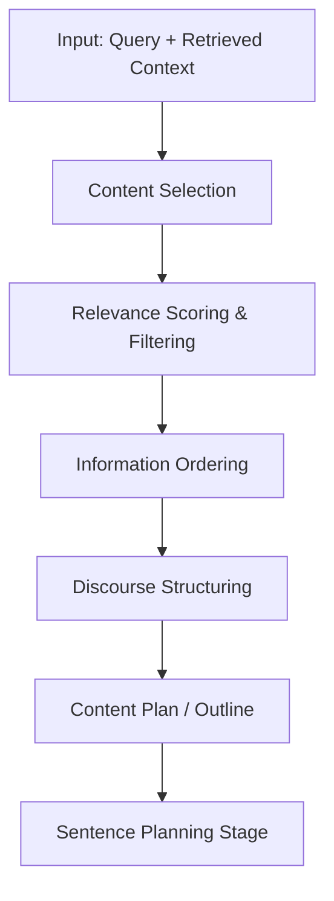

# 02.3.NLG. Generating Text

  <table>
    <tr>
      <td align="center"></td>
      <td align="center"></td>
      <td align="center"></td>
      <td align="center"></td>
    </tr>
  </table>

## 02.3.1. Content Planning

### <td align="center"> Introduction

**Content Planning** is the first stage of Natural Language Generation (NLG). It determines **what to say** before deciding **how to say it**.

Given an input — a user query, retrieved documents, structured data, or a goal — content planning selects and organizes the relevant information that should appear in the final generated text. It acts as the blueprint for everything that follows in the NLG pipeline.

Example:

> Input: Retrieved facts about climate change impacts  
> Goal: Generate a structured summary report

Content Planning decides:
- **What facts** to include (rising temperatures, sea levels, extreme weather)
- **What to omit** (redundant or low-relevance data)
- **What order** to present the information (cause → effect → outlook)
- **What rhetorical structure** to use (problem/solution, narrative, list)

Without content planning, generated text risks being verbose, repetitive, unstructured, or missing critical information.

---

### <td align="center"> Why use it?

- Ensure generated text is **coherent and goal-oriented**
- Select only the **most relevant** information from a large input
- Define the **logical structure** of the output before generation
- Prevent **information overload** or irrelevant content in responses
- Support **long-form generation** (reports, articles, summaries) with clear organization
- Enable **controllable generation** — shaping what the LLM focuses on
- Improve **faithfulness** in RAG by explicitly planning which retrieved chunks to use

Without content planning, systems generate text reactively word-by-word without a structured goal, leading to drift, repetition, and incomplete responses.

---

### <td align="center"> How it works?

#### Step-by-step Process

1. **Input Analysis**
   - Understand the communicative goal: What does the user need?
   - Identify available information: retrieved chunks, structured data, conversation history

2. **Content Selection**
   - Score and filter candidate facts or passages by relevance to the goal
   - Remove redundant, contradictory, or low-confidence information

3. **Information Ordering**
   - Arrange selected content in a logical sequence:
     - Chronological, causal, importance-based, or narrative order

4. **Discourse Structuring**
   - Define the rhetorical structure of the output:
     - Introduction → Body → Conclusion
     - Problem → Analysis → Solution
     - Claim → Evidence → Summary

5. **Plan Representation**
   - Encode the plan as a structured outline, prompt template, or intermediate representation passed to the next NLG stage (Sentence Planning)

#### Example Flow

#### Content Planning Strategies

| Strategy | Description | Best For |
|----------|-------------|----------|
| Template-based | Predefined slots filled with selected content | Structured, predictable outputs |
| Schema-guided | Follows a document schema (intro, body, conclusion) | Reports, articles |
| Salience-based | Ranks content by importance score | Summarization |
| Causal/Temporal | Orders content by cause-effect or time | Narratives, event descriptions |
| LLM-guided | Prompts LLM to produce an outline first | Flexible, open-domain generation |

---

### <td align="center"> Components

**1. Communicative Goal Analyzer**
Determines the purpose and target of the generated text:
- Inform, summarize, explain, persuade, narrate, instruct

**2. Content Selector**
Filters and scores candidate information units:
- Relevance scoring (embedding similarity, keyword overlap)
- Redundancy removal (MMR — Maximal Marginal Relevance)
- Confidence filtering (only include high-certainty facts)

**3. Information Orderer**
Sequences the selected content logically:
- Chronological ordering
- Importance-first (inverted pyramid)
- Causal chaining (A causes B causes C)

**4. Discourse Structurer**
Defines the macro-level organization of the output:
- Rhetorical Structure Theory (RST) relations: elaboration, contrast, cause, sequence
- Document schemas: title, abstract, sections, conclusion

**5. Plan Representation**
The output of content planning — an intermediate structured representation:
- Bullet-point outline
- Slot-filler template
- JSON plan passed to downstream stages
- Chain-of-thought prompt for LLMs

---

### <td align="center"> Use Cases

- **RAG Response Generation** — plan which retrieved chunks to cite and in what order
- **Automated Report Writing** — generate structured business, medical, or financial reports
- **Text Summarization** — select and order the most salient points from a document
- **Chatbot Long-form Responses** — organize multi-paragraph answers coherently
- **Data-to-Text Generation** — convert structured data (tables, KGs) into readable narratives
- **News Article Generation** — plan headline, lead, body, and conclusion
- **Instructional Content** — generate step-by-step guides with logical ordering
- **Personalized Emails / Documents** — select relevant content per user profile

---

###  Limitations

- **Content selection errors** propagate through the entire NLG pipeline
- Template-based planning is **rigid** and fails on open-domain inputs
- Scoring relevance is difficult when **multiple valid orderings** exist
- LLM-guided planning may produce **hallucinated outlines** not grounded in retrieved facts
- Long input contexts make **selection** computationally expensive
- Hard to evaluate content plans independently from the final generated text
- **Domain shift** — plans optimized for one domain generalize poorly to others
