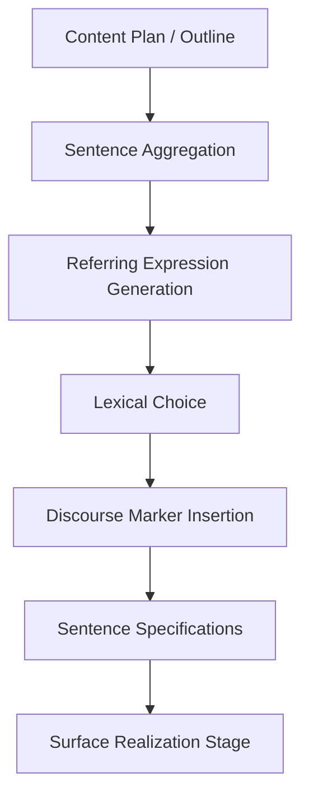

# 02.3.NLG. Generating Text

  <table>
    <tr>
      <td align="center"></td>
      <td align="center"></td>
      <td align="center"></td>
      <td align="center"></td>
    </tr>
  </table>

## 02.3.2. Sentence Planning

### <td align="center"> Introduction

**Sentence Planning** is the second stage of Natural Language Generation (NLG). It bridges the gap between **what to say** (Content Planning) and **how to say it word-by-word** (Surface Realization).

Given a structured content plan, sentence planning decides:
- How to **aggregate** multiple pieces of information into sentences
- Which **referring expressions** to use (pronouns, names, descriptions)
- What **lexical choices** (word selection) best convey the intended meaning
- How to connect sentences with **discourse markers** for fluency and cohesion

Example:

> Content Plan:
> - Fact 1: Python is a programming language
> - Fact 2: Python is widely used in data science
> - Fact 3: Python supports many libraries

> Sentence Plan output:
> - Aggregate facts 1 & 2 → one sentence
> - Use "it" as referring expression for Python in fact 3
> - Connect with "Additionally" discourse marker

> Result: *"Python is a programming language widely used in data science. Additionally, it supports a rich ecosystem of libraries."*

Without sentence planning, generated text may be grammatically correct but reads as a list of disjointed facts rather than coherent prose.

---

### <td align="center"> Why use it?

- Transform a structured plan into **natural, fluent sentences**
- **Aggregate** related facts to avoid choppy, repetitive output
- Choose the **right words** (lexicalization) for the target audience and tone
- Maintain **coreference** consistency (avoid repeating full names unnecessarily)
- Add **discourse connectives** that signal logical relationships (contrast, cause, sequence)
- Control **sentence length and complexity** for readability
- Produce text that feels **human-written** rather than machine-assembled

Without sentence planning, NLG systems produce either overly fragmented output (one fact per sentence) or uncontrolled walls of text with no internal structure.

---

### <td align="center"> How it works?

#### Step-by-step Process

1. **Input: Content Plan**
   - Receives the ordered, structured outline from the Content Planning stage

2. **Sentence Aggregation**
   - Decides which facts or clauses to combine into a single sentence vs. keep separate
   - Balances information density against readability

3. **Referring Expression Generation (REG)**
   - Determines how to refer to entities across sentences:
     - First mention → full name ("the data scientist")
     - Subsequent mentions → pronoun ("she") or shortened form ("the scientist")

4. **Lexical Choice (Lexicalization)**
   - Selects specific words and phrases to express each concept:
     - "used" vs. "employed" vs. "leveraged"
     - Formal vs. casual register
     - Domain-appropriate terminology

5. **Discourse Marker Insertion**
   - Adds connective words and phrases to signal relationships:
     - Addition: "Furthermore", "Additionally", "Moreover"
     - Contrast: "However", "On the other hand", "Nevertheless"
     - Cause: "Therefore", "As a result", "Consequently"
     - Sequence: "First", "Next", "Finally"

6. **Output: Sentence Specs**
   - Produces a set of sentence-level specifications passed to Surface Realization

#### Example Flow

#### Aggregation Strategies

| Strategy | Description | Example |
|----------|-------------|---------|
| Conjunction | Join facts with "and" / "but" | "Python is fast and readable." |
| Subordination | Embed one fact inside another | "Python, which is fast, is widely used." |
| Relative Clause | Add detail via relative clause | "Python, known for readability, is popular." |
| Apposition | Place extra info next to a noun | "Python, a high-level language, supports..." |
| Separate Sentences | Keep facts independent | "Python is fast. It is also readable." |

---

### <td align="center"> Components

**1. Sentence Aggregator**
Groups related content units into sentence-sized chunks:
- Avoids one-fact-per-sentence monotony
- Prevents information overload in a single sentence
- Uses syntactic patterns (coordination, subordination, apposition)

**2. Referring Expression Generator (REG)**
Handles entity references consistently across the text:
- **Full reference:** first mention or after topic shift
- **Pronoun:** when the referent is unambiguous and recent
- **Definite description:** "the model", "the algorithm"
- Avoids ambiguity and unnecessary repetition

**3. Lexicalizer**
Maps abstract content concepts to concrete words:
- Selects from synonyms based on register, tone, and domain
- Chooses between active/passive voice
- Adjusts formality for the target audience (technical vs. general)

**4. Discourse Marker Selector**
Inserts connective phrases to signal logical relationships between sentences and clauses:
- Additive, contrastive, causal, temporal, and exemplification markers

**5. Sentence Spec Encoder**
Produces a structured representation of each planned sentence:
- Subject, predicate, object, modifiers
- Syntactic frame specification
- Passed to the Surface Realization stage for final rendering

---

### <td align="center"> Use Cases

- **RAG Response Generation** — turn retrieved bullet points into coherent paragraphs
- **Automated Report Writing** — convert structured data rows into readable sentences
- **Text Summarization** — merge and rephrase source sentences into a concise summary
- **Chatbot Responses** — produce natural multi-sentence replies from intent + entities
- **Data-to-Text Generation** — narrate tables, charts, or database records in prose
- **Dialogue Systems** — maintain coreference and tone consistency across conversation turns
- **Personalized Content** — adjust lexical choices and formality per user profile
- **Machine Translation Post-editing** — re-plan sentence structure for fluency in target language

---

###  Limitations

- **Over-aggregation** can produce sentences that are too long or complex to parse
- **Under-aggregation** results in choppy, robotic-sounding output
- Referring expression errors cause **ambiguous coreference** (unclear pronoun referents)
- Lexical choice is **context-sensitive** and hard to get right without domain knowledge
- Discourse marker misuse leads to **incoherent logical flow** (e.g., using "however" for a non-contrastive relation)
- LLM-based sentence planning may **hallucinate phrasing** not grounded in the content plan
- Difficult to evaluate independently from surface realization quality

