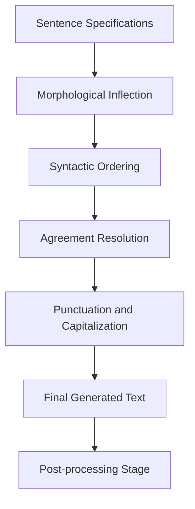

# 01.2.3 NLG — Generating Text

  <table>
    <tr>
      <td align="center"></td>
      <td align="center"></td>
      <td align="center"></td>
      <td align="center"></td>
    </tr>
  </table>

## 01.2.3.3 Surface Realization

### <td align="center"> Introduction

**Surface Realization** is the final generation stage of Natural Language Generation (NLG). It takes the structured sentence specifications produced by Sentence Planning and converts them into **actual, grammatically correct, fluent text** ready for the user.

While Content Planning decides *what to say* and Sentence Planning decides *how to structure it*, Surface Realization decides **the exact words, grammar, and form** of every sentence in the output.

Example:

> Sentence Spec (from Sentence Planning):
> - Subject: Python
> - Predicate: support
> - Object: multiple paradigms
> - Modifier: including object-oriented and functional
> - Voice: active
> - Tense: present simple

> Surface Realization output:
> *"Python supports multiple paradigms, including object-oriented and functional programming."*

Surface Realization handles all the linguistic details that make output sound natural — verb conjugation, agreement, word order, punctuation, and morphology — so upstream stages can reason at a higher, more abstract level.

---

### <td align="center"> Why use it?

- Convert abstract sentence plans into **grammatically correct, readable text**
- Handle all **morphological inflections** (verb tenses, plural forms, case agreement)
- Ensure **syntactic agreement** between subject, verb, and object
- Apply correct **punctuation and capitalization** rules
- Produce output that is **fluent and natural** sounding across languages
- Separate linguistic concerns from planning logic, enabling **modular NLG systems**
- Support **multilingual generation** by swapping the realization component per language

Without surface realization, even a perfectly structured sentence plan would remain an abstract, unreadable specification rather than human-facing text.

---

### <td align="center"> How it works?

#### Step-by-step Process

1. **Input: Sentence Specifications**
   - Receives structured specs from Sentence Planning (subject, predicate, object, modifiers, voice, tense, mood)

2. **Morphological Inflection**
   - Applies correct word forms based on grammatical features:
     - Verb conjugation: "run" → "runs" / "ran" / "running"
     - Noun pluralization: "library" → "libraries"
     - Adjective agreement (in gendered languages): "bon" → "bonne"

3. **Syntactic Ordering**
   - Arranges words into the correct order for the target language:
     - English: Subject → Verb → Object (SVO)
     - German: Verb-second (V2) word order
     - Japanese: Subject → Object → Verb (SOV)

4. **Agreement Resolution**
   - Enforces grammatical agreement:
     - Subject-verb: "She runs" (not "She run")
     - Determiner-noun: "an apple" (not "a apple")
     - Pronoun-antecedent: number and gender consistency

5. **Punctuation & Capitalization**
   - Inserts commas, periods, colons, dashes appropriately
   - Capitalizes sentence starts, proper nouns, and titles

6. **Output: Final Text**
   - Produces the fully formed, human-readable text string
   - Passed to Post-processing for final formatting and quality checks

#### Example Flow

#### Realization Approaches Compared

| Approach | Description | Strength | Weakness |
|----------|-------------|----------|----------|
| Template-based | Fill slots in handcrafted sentence patterns | Fast, predictable, controllable | Rigid, limited variety |
| Grammar-based | Use formal grammars (e.g., CCG, TAG, FUF) | Linguistically precise | Complex to build and maintain |
| Neural (LLM) | Fine-tuned models generate text end-to-end | Fluent, flexible, handles edge cases | Less controllable, may hallucinate |
| Hybrid | Grammar rules + neural fluency scoring | Balances control and fluency | Pipeline complexity |

---

### <td align="center"> Components

**1. Morphological Inflector**
Applies language-specific word-form transformations:
- Verb tense and aspect: present, past, future, progressive, perfect
- Noun number: singular / plural
- Adjective degree: positive / comparative / superlative
- Case inflection (in languages like German, Russian, Finnish)

**2. Syntactic Linearizer**
Orders tokens into a grammatically valid surface string:
- Follows language-specific phrase structure rules
- Handles constituent ordering (head-initial vs. head-final languages)
- Places modifiers correctly (pre- vs. post-nominal adjectives)

**3. Agreement Module**
Enforces grammatical agreement constraints:
- Subject-verb number and person agreement
- Determiner-noun agreement
- Pronoun-antecedent gender and number agreement

**4. Punctuation & Capitalization Engine**
Applies typographic conventions:
- Sentence boundary punctuation (. ! ?)
- Clause-internal punctuation (, ; : —)
- Capitalization rules (sentence start, proper nouns, acronyms)

**5. Fluency Scorer (optional)**
Scores candidate realizations using a language model:
- Selects the most fluent among multiple valid surface forms
- Used in systems that generate multiple candidates and re-rank

**6. Multilingual Adapter (optional)**
Adapts realization rules for the target language:
- Language-specific morphology engines (e.g., spaCy, Stanza, UDPipe)
- Handles gendered nouns, agglutination, tonal languages

---

### <td align="center"> Use Cases

- **RAG Response Generation** — render final grounded answers from structured plans
- **Automated Report Writing** — convert structured data narrations into polished prose
- **Chatbot & Virtual Assistants** — produce grammatically correct, natural-sounding replies
- **Machine Translation** — realize translated sentence structures in the target language
- **Data-to-Text Systems** — transform database records or tables into readable sentences
- **Dialogue Systems** — generate turn-by-turn responses with consistent grammar
- **Multilingual NLG** — generate text in multiple languages from a single content plan
- **Accessibility Tools** — convert structured information into plain language for broader audiences

---

###  Limitations

- Template-based realization is **inflexible** and breaks on out-of-template inputs
- Grammar-based systems are **expensive to build** and require deep linguistic expertise
- Neural realization can **hallucinate** words or phrases not present in the input spec
- Morphological complexity varies dramatically across languages — solutions for English rarely transfer directly
- Agreement errors are hard to detect without a dedicated **grammar checker** downstream
- Fluency and **faithfulness** can conflict: a fluent sentence is not always factually accurate
- Performance degrades on **low-resource languages** with limited training data
