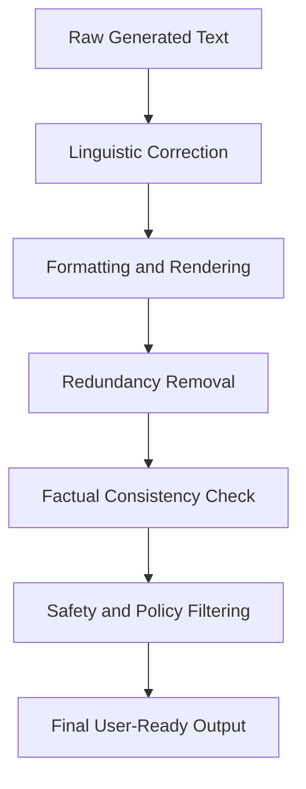

# 01.2.3 NLG — Generating Text

  <table>
    <tr>
      <td align="center"></td>
      <td align="center"></td>
      <td align="center"></td>
      <td align="center"></td>
    </tr>
  </table>

## 01.2.3.4 Post processing

### <td align="center"> Introduction

**Post-processing** is the final stage of the Natural Language Generation (NLG) pipeline. After Surface Realization produces raw generated text, post-processing **refines, validates, and formats** the output before it reaches the user.

It acts as a quality gate — catching grammatical issues, formatting inconsistencies, hallucinated content, safety violations, and presentation problems that earlier stages may have introduced or failed to resolve.

Example:

> Raw Surface Realization output:
> *"python is a programing language .it is use widely in data science , and machine learning"*

> After Post-processing:
> *"Python is a programming language. It is widely used in data science and machine learning."*

Post-processing transforms raw, imperfect generated text into **polished, safe, and user-ready output** — regardless of whether the generation was template-based, grammar-based, or driven by a large language model.

---

### <td align="center"> Why use it?

- Fix **spelling and grammar errors** introduced during generation
- Apply consistent **formatting rules** (headings, lists, code blocks, markdown)
- Remove **hallucinated, irrelevant, or redundant** content
- Enforce **safety and content policies** (toxicity filtering, PII removal)
- Ensure **factual consistency** between the output and the retrieved source context
- Adapt the output to the **target medium** (chat UI, PDF report, voice assistant, API response)
- Improve **readability and conciseness** by trimming verbose or repetitive passages
- Validate **structured outputs** (JSON, tables, code) for correctness before delivery

Without post-processing, even a well-planned and realized text can fail at the last mile due to formatting errors, unsafe content, or factual inconsistencies.

---

### <td align="center"> How it works?

#### Step-by-step Process

1. **Input: Raw Generated Text**
   - Receives the fully realized text string from Surface Realization

2. **Linguistic Correction**
   - Spell-checking and grammar correction
   - Punctuation normalization
   - Capitalization fixes

3. **Formatting & Rendering**
   - Apply target-format rules: Markdown, HTML, plain text, JSON, SSML (for voice)
   - Structure output into paragraphs, bullet lists, headings, or code blocks as needed
   - Trim leading/trailing whitespace and normalize line breaks

4. **Redundancy & Repetition Removal**
   - Detect and remove duplicate sentences or overly similar passages
   - Condense verbose phrasing into concise equivalents

5. **Factual & Consistency Checking**
   - Cross-reference output against retrieved source documents (in RAG systems)
   - Flag or remove claims not grounded in the provided context

6. **Safety & Policy Filtering**
   - Screen for toxic, harmful, biased, or policy-violating content
   - Detect and redact PII (names, emails, phone numbers, addresses)
   - Apply domain-specific compliance rules (medical, legal, financial disclaimers)

7. **Output: Final User-Ready Text**
   - Delivers the clean, formatted, validated response to the application layer

#### Example Flow

#### Post-processing Tasks by Category

| Category | Tasks | Tools / Methods |
|----------|-------|-----------------|
| Linguistic | Spell-check, grammar fix, punctuation | LanguageTool, Grammarly API, spaCy |
| Formatting | Markdown rendering, paragraph breaks | Regex, template rules, parsers |
| Redundancy | Deduplication, verbosity reduction | Sentence similarity, summarization |
| Factual | Hallucination detection, grounding check | NLI models, RAG source cross-reference |
| Safety | Toxicity filter, PII redaction, policy | Perspective API, regex, NER |
| Structured | JSON validation, code syntax check | JSON schema, AST parsers |

---

### <td align="center"> Components

**1. Linguistic Corrector**
Fixes surface-level language errors that slipped through generation:
- Spell-checker (e.g., `pyspellchecker`, `Hunspell`)
- Grammar checker (e.g., `LanguageTool`, `after-the-deadline`)
- Punctuation normalizer and sentence boundary fixer

**2. Formatter**
Converts raw text into the target presentation format:
- **Markdown / HTML:** headings, bold, italics, lists, code blocks
- **SSML:** Speech Synthesis Markup Language for voice assistants
- **JSON / XML:** structured output for API consumers
- **Plain text:** stripped of markup for legacy systems

**3. Redundancy Remover**
Detects and eliminates repeated or near-duplicate content:
- Sentence-level deduplication using cosine similarity
- Compression of verbose phrases into concise equivalents
- Paragraph-level coherence checks

**4. Factual Consistency Checker**
Verifies generated claims against source context (critical in RAG):
- Natural Language Inference (NLI) models to detect contradictions
- Named entity cross-reference against retrieved documents
- Confidence scoring to flag low-certainty statements

**5. Safety & Compliance Filter**
Screens output for harmful or non-compliant content:
- **Toxicity detection:** hate speech, profanity, threats
- **PII redaction:** names, emails, phone numbers, IDs
- **Bias detection:** stereotyping, discriminatory language
- **Domain disclaimers:** medical, legal, financial warnings

**6. Structured Output Validator**
For non-prose outputs, validates correctness of structure:
- JSON schema validation
- Code syntax checking (AST parsing)
- Table format consistency

---

### <td align="center"> Use Cases

- **RAG Systems** — verify that generated answers are grounded in retrieved documents
- **Customer Support Chatbots** — enforce tone, safety, and brand compliance before delivery
- **Automated Report Generation** — apply consistent formatting and remove redundant sections
- **Voice Assistants** — convert text to SSML with correct prosody markers
- **Code Generation** — validate syntax and run static analysis on generated code
- **Medical / Legal NLG** — append required disclaimers and redact sensitive information
- **Multilingual Systems** — normalize formatting conventions per target locale
- **Content Moderation Pipelines** — screen AI-generated content before publication

---

###  Limitations

- **False positives** in safety filters can censor legitimate content
- Factual consistency checking via NLI is **computationally expensive** at scale
- Formatting rules are **medium-specific** — a Markdown formatter breaks plain-text pipelines
- PII redaction may **miss novel or obfuscated patterns** not covered by existing rules
- Redundancy removal can accidentally **delete important repeated emphasis**
- Post-processing adds **latency** to the generation pipeline — critical for real-time systems
- Over-aggressive correction can **alter the intended meaning** of the original generation
- Hard to define universal **quality thresholds** that work across domains and use cases
