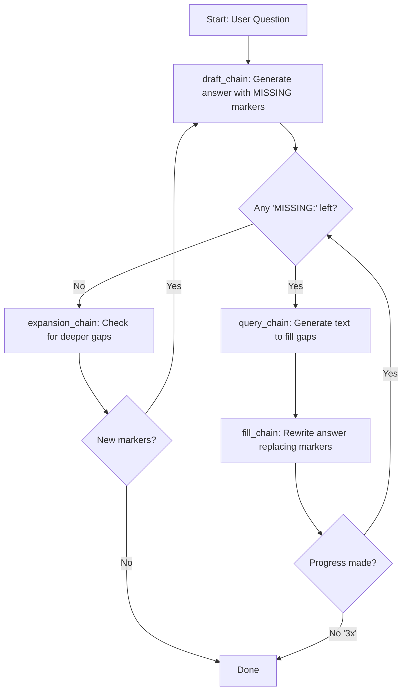
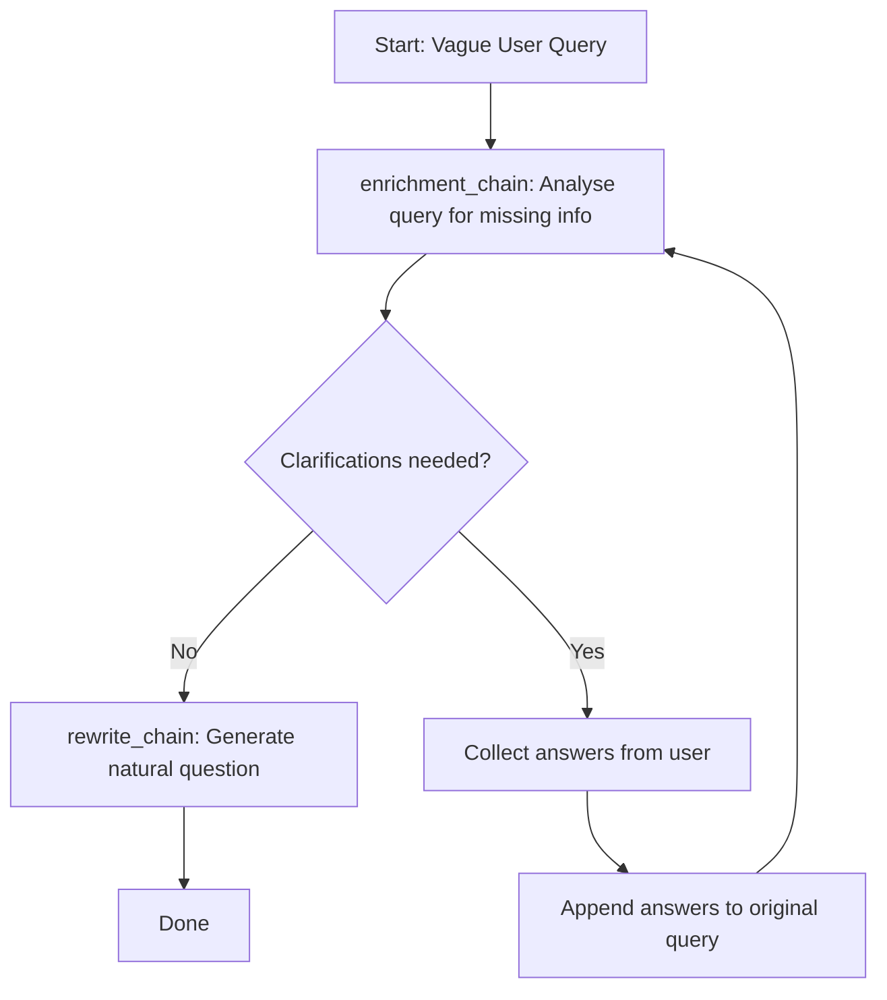

## Project Summary

This project demonstrates three levels of prompt enrichment for LLMs, progressing from a basic direct call to iterative gap-filling and interactive clarification loops. All scripts use LangChain 1.0.0a5 with `ollama:llama3.2`.

### 0-No-expansion.py

A baseline that sends the question to the LLM directly, with no query expansion, retrieval, or refinement. Serves as a comparison point for the enriched approaches.

### 1-ITER_RETGEN.py

Enriches prompts through iterative retrieval-and-generation with `[MISSING: ...]` markers. The loop:

1. Drafts an answer with explicit gaps marked as `[MISSING: topic]`
2. Generates text to fill each gap
3. Re-writes the answer replacing markers with real content
4. Repeats until no gaps remain or max iterations are reached

### 2-query-enrichment.py

Interactive enrichment that identifies missing information in vague queries. The system asks clarifying questions (e.g. PR ID, repository, concerns) in rounds until all required details are provided, then rewrites the query into a well-formed question.

