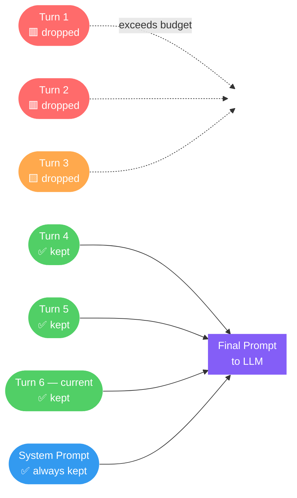
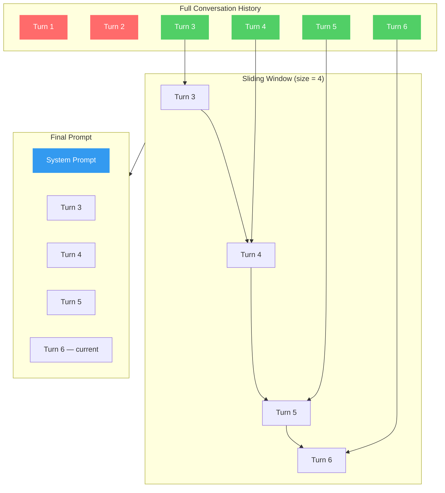
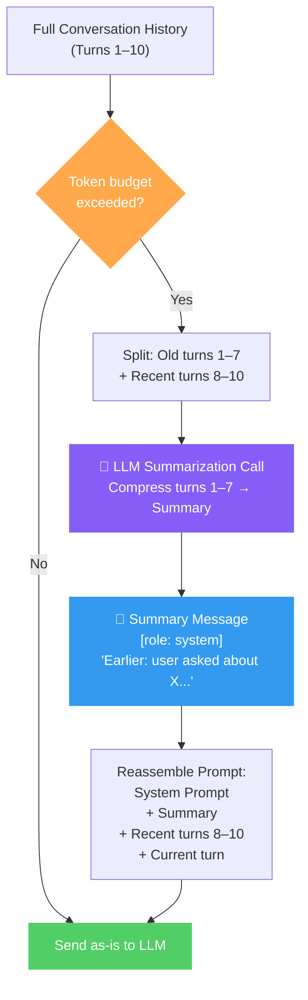
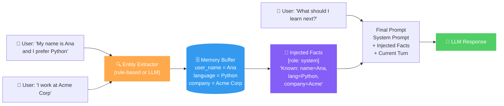
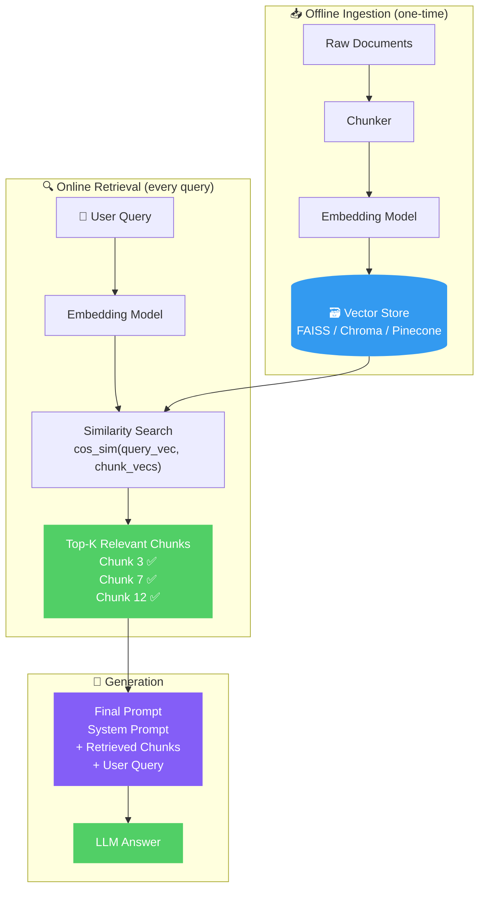
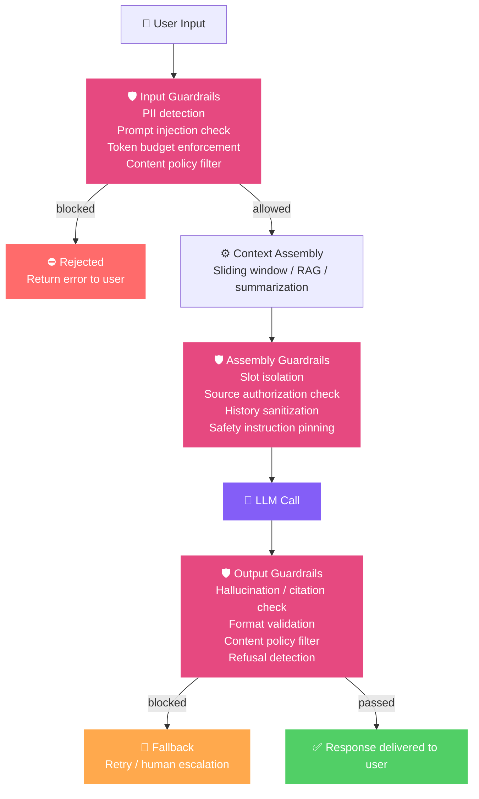

# 05. Context Management

##   Overview

Context Management is the **operational layer** that sits between your raw data/history and the model's input window. It governs *what* gets into the prompt, *how much* of it fits, and *how* to keep responses accurate and relevant — even when conversations grow long or knowledge bases are large.

---

### <td align="center"> Introduction

---

Every Large Language Model operates within a **context window** — a hard limit on the number of tokens it can process in a single forward pass. This window includes the system prompt, conversation history, retrieved documents, tool outputs, and the model's own reply.

Context Management is the discipline of working *within* that constraint intelligently. Rather than naively stuffing everything into the prompt, a well-designed context management layer selects, compresses, and organizes information so the model always receives the most relevant signal with the least noise.

**Mental model:**
> *"Given limited space, what should I put into the prompt?"*

---

### <td align="center"> Why use it?

---

| Problem | Consequence without Context Management |
|---|---|
| Context window overflow | Hard API errors or silent truncation of critical content |
| Irrelevant information in prompt | Model gets distracted, produces off-topic answers |
| Stale or contradictory history | Model hallucinates or contradicts itself |
| Repeated tokens across turns | Wasted cost and latency |
| No memory across sessions | User has to repeat themselves every conversation |

Context Management directly prevents:

- 🔴 **Token overflow** — exceeding the model's maximum context length
- 🟡 **Irrelevant information** — padding the prompt with content that dilutes focus
- 🟠 **Context-induced hallucinations** — the model fabricating details to fill gaps left by missing or poorly ordered context

---

### <td align="center"> Components

---

```
┌─────────────────────────────────────────────────┐
│                  Context Window                  │
│                                                  │
│  ┌──────────────┐  ┌──────────────────────────┐  │
│  │ System Prompt│  │   Conversation History   │  │
│  └──────────────┘  └──────────────────────────┘  │
│  ┌──────────────┐  ┌──────────────────────────┐  │
│  │  Retrieved   │  │   Tool / Function Output │  │
│  │  Documents   │  │                          │  │
│  └──────────────┘  └──────────────────────────┘  │
│  ┌──────────────────────────────────────────────┐ │
│  │              Current User Turn               │ │
│  └──────────────────────────────────────────────┘ │
└─────────────────────────────────────────────────┘
```

**Key components managed:**

1. **System Prompt** — Instructions, persona, and constraints. Usually fixed but may be trimmed dynamically.
2. **Conversation History** — Prior user/assistant turns. Grows unboundedly without management.
3. **Retrieved Context** — Chunks from RAG pipelines, documents, or tool results.
4. **Working Memory Buffer** — Short-term state accumulated during a multi-step task.
5. **Long-term Memory Store** — Persisted facts or summaries retrieved across sessions.

---

### <td align="center"> How it works?

---

#### 1. Truncation

The simplest strategy: when the accumulated history exceeds the token budget, messages are dropped from the **oldest end** of the conversation. The system prompt and the most recent turn are always preserved.



**How it works step by step:**
1. After each new turn, the token counter is updated.
2. If `total_tokens > max_tokens`, the oldest non-system message is removed.
3. This repeats until the prompt fits within the budget.
4. The system prompt is always pinned and never evicted.


```python
def truncate_history(messages, max_tokens, tokenizer):
    total = 0
    kept = []
    for msg in reversed(messages):
        tokens = len(tokenizer.encode(msg["content"]))
        if total + tokens > max_tokens:
            break
        kept.append(msg)
        total += tokens
    return list(reversed(kept))
```

✅ Easy to implement  
⚠️ Loses early context that may still be relevant

---

#### 2. Sliding Window

Instead of evicting one message at a time, the sliding window keeps a **fixed-size frame** of the most recent *N* turns. The window slides forward with each new exchange, keeping memory usage strictly bounded and predictable.



**How it works step by step:**
1. Define a fixed window size *N* (e.g., last 10 messages or last 4k tokens).
2. On every turn, slice the dialogue array to keep only the tail of size *N*.
3. The system prompt is prepended outside the window — it is never counted against *N*.
4. The window moves forward automatically as new turns arrive.


```python
def sliding_window(messages, window_size=10):
    # Always keep system prompt + last N human/assistant pairs
    system = [m for m in messages if m["role"] == "system"]
    dialogue = [m for m in messages if m["role"] != "system"]
    return system + dialogue[-window_size:]
```

✅ Predictable memory footprint  
⚠️ Older turns with key facts are silently dropped

---

#### 3. Summarization

Rather than discarding old turns entirely, summarization **compresses** them into a compact summary using a secondary LLM call. That summary is then injected back into the prompt as a synthetic system message, preserving the semantic gist while freeing up tokens.



**How it works step by step:**
1. Monitor token count after each turn.
2. When it exceeds the threshold, partition history into *old* (to compress) and *recent* (to keep verbatim).
3. Send the old turns to an LLM with a compression prompt.
4. Replace the old turns with the returned summary as a `system` role message.
5. Continue the conversation with `[summary] + [recent turns] + [current turn]`

```python
def summarize_old_turns(old_messages, llm):
    transcript = "\n".join(f"{m['role']}: {m['content']}" for m in old_messages)
    summary = llm.complete(f"Summarize this conversation concisely:\n{transcript}")
    return {"role": "system", "content": f"[Earlier conversation summary]: {summary}"}
```

✅ Retains semantic content  
⚠️ Introduces a second LLM call and potential summary errors

---

#### 4. Memory Buffers

A memory buffer is a **structured store** that extracts and persists discrete facts during the conversation. Instead of replaying raw dialogue, only the relevant extracted facts are injected into each prompt — keeping the context lean and targeted.



```
User says: "My name is Ana and I prefer Python."
→ Buffer: { "user_name": "Ana", "preferred_language": "Python" }
→ Injected at each turn as: "Known facts: user_name=Ana, preferred_language=Python"
```

✅ Compact and targeted  
⚠️ Requires an extraction step; may miss implicit information

---

#### 5. Basic RAG (Retrieval-Augmented Generation)
Instead of putting *all* documents in the prompt, retrieve only the top-K relevant chunks at query time.

Instead of loading *all* documents into the prompt (impossible at scale), RAG **retrieves only the most relevant chunks** at query time using semantic similarity search. Only those chunks are injected into the prompt alongside the user's question.



**How it works step by step:**
1. **Ingestion** — Documents are split into chunks (e.g., 512 tokens with 50-token overlap), embedded into dense vectors, and stored in a vector database.
2. **Query embedding** — At runtime, the user's query is embedded using the same model.
3. **Similarity search** — The vector store returns the top-K chunks whose embeddings are closest to the query vector (cosine similarity).
4. **Injection** — The retrieved chunks are formatted and prepended to the prompt as grounding context.
5. **Generation** — The LLM answers using only the provided chunks, reducing hallucination.

```python
def rag_retrieve_and_inject(query, vector_store, embedder, top_k=3):
    query_vec = embedder.encode(query)
    chunks = vector_store.search(query_vec, top_k=top_k)
    context = "\n\n".join(f"[Doc {i+1}]: {c}" for i, c in enumerate(chunks))
    return f"Use the following context to answer:\n{context}\n\nQuestion: {query}"
```

✅ Scales to large knowledge bases  
⚠️ Retrieval quality determines answer quality

---

#### 6. Guardrails

Guardrails are **validation and filtering mechanisms** applied at the boundaries of the context pipeline — before content enters the context window, during assembly, and after the model responds. While the other five techniques govern *how much* fits in the prompt, guardrails govern *what is safe and appropriate* to include or return at all.



Guardrails operate in three stages:

**Stage 1 — Input guardrails** (before context assembly)

| Guardrail | What it does |
|---|---|
| PII detection | Detects and redacts personal data before it enters history or is sent to the model |
| Prompt injection detection | Flags inputs attempting to override system instructions |
| Token budget enforcement | Rejects or truncates inputs that exceed the per-slot maximum |
| Content policy filter | Blocks inputs that violate acceptable use policies |

**Stage 2 — Assembly guardrails** (during context construction)

| Guardrail | What it does |
|---|---|
| Slot isolation | Prevents user-controlled content from bleeding into the system prompt slot |
| Source authorization | Verifies retrieved chunks come from sources the user is allowed to access |
| History sanitization | Redacts sensitive content from prior turns before they are re-injected |
| Safety instruction pinning | Ensures safety-critical system prompt content survives overflow truncation |

**Stage 3 — Output guardrails** (after model response)

| Guardrail | What it does |
|---|---|
| Hallucination / citation check | Verifies that factual claims in the output are grounded in retrieved context |
| Format validation | Rejects responses that do not conform to the expected schema; triggers a retry |
| Content policy filter | Scans output for harmful, false, or policy-violating content before delivery |
| Refusal detection | Catches unexpected model refusals and routes to a fallback or human escalation |

**How it works step by step:**
1. User input is passed through input guardrails before any context assembly begins.
2. If blocked, an error is returned immediately — the model is never called.
3. During context assembly, slot isolation and sanitization are applied to assembled content.
4. The safety-critical portion of the system prompt is hard-pinned so overflow logic cannot evict it.
5. After the model responds, output guardrails validate the response before it reaches the user.
6. If output validation fails, a retry or fallback is triggered — not a silent delivery of bad output.

```python
def apply_input_guardrails(user_input, policy):
    if policy.contains_pii(user_input):
        user_input = policy.redact_pii(user_input)
    if policy.is_injection_attempt(user_input):
        raise GuardrailViolation("Prompt injection detected")
    if policy.token_count(user_input) > policy.max_input_tokens:
        raise GuardrailViolation("Input exceeds token budget")
    return user_input

def apply_output_guardrails(response, retrieved_chunks, policy):
    if not policy.citations_grounded(response, retrieved_chunks):
        raise GuardrailViolation("Ungrounded claims detected — triggering retry")
    if not policy.valid_format(response):
        raise GuardrailViolation("Output schema mismatch — triggering retry")
    return response
```

> **Critical rule:** The system prompt slot — particularly any safety instructions — must be **hard-pinned** and exempt from all overflow truncation strategies. If something must be dropped to fit the budget, it should always be conversation history or retrieved context before it is ever a safety instruction.

✅ Prevents harmful, non-compliant, or adversarial content from entering or leaving the pipeline  
⚠️ Each guardrail layer adds latency; a full three-stage stack typically adds 50–150ms per request

---

### <td align="center"> Use Cases

---

| Use Case | Technique(s) |
|---|---|
| Long customer support chat | Sliding window + periodic summarization |
| Document Q&A | Basic RAG pipeline |
| Multi-step coding assistant | Working memory buffer |
| Voice/IVR conversation | Aggressive truncation (low-latency budget) |
| Personalized assistant | Long-term memory store |
| Legal contract analysis | Chunked retrieval with overlap |
| Public-facing or regulated system | Guardrails at all three stages |
| Multi-tenant SaaS with per-user data | Assembly guardrails (source authorization + slot isolation) |

---

###  Limitations

---

- **Summarization loss** — Compression always loses some detail. Critical numbers, names, or constraints may be dropped.
- **Truncation blindness** — Simple cutoffs don't know *which* old messages matter. A user preference stated 20 turns ago may be silently lost.
- **Retrieval errors in RAG** — If the retriever returns irrelevant chunks, the model may hallucinate or ignore the retrieved content entirely.
- **Token counting overhead** — Accurate token budgeting requires calling a tokenizer on every message, adding latency.
- **Window size is a moving target** — Model providers update context limits; hardcoded limits become stale.
- **No gold standard** — There is no universal best strategy; the optimal approach depends on domain, latency budget, and model.
- **Guardrail latency cost** — Each guardrail stage adds processing time. A full three-stage stack (input + assembly + output) typically adds 50–150ms; classifier-based guardrails may add more. Factor this into SLA design from the start, not as an afterthought.
- **Guardrail false positives** — Overly aggressive input filters block legitimate requests. PII detectors misfire on fictional names; injection classifiers flag power-user prompts. Threshold tuning is an ongoing operational task, not a one-time setup.
