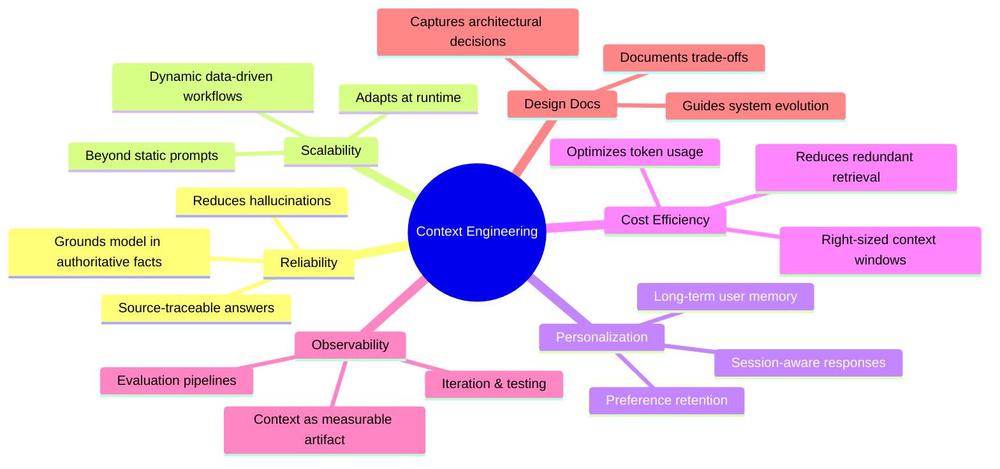
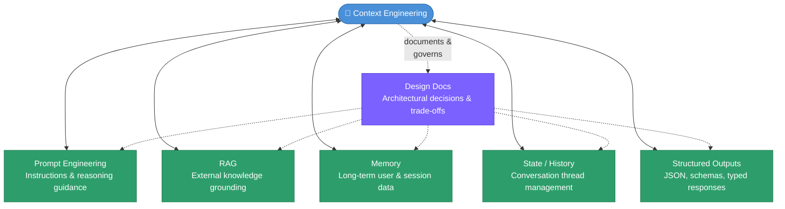

# 07. Context Engineering

##  Overview

Context Engineering is the **strategic discipline** of designing and managing the entire information environment that surrounds an AI model — not just the prompt, but the full ecosystem of data, memory, tools, and state that flows in and out of the model at every step.

> **"How should context flow through my entire system?"**

It sits one layer above prompt engineering and context management, treating context as a **first-class architectural component** of production AI systems.

| Aspect | Context Management | Context Engineering |
|--------|-------------------|---------------------|
| Level | Tactical | Strategic |
| Scope | Single prompt / interaction | Full system architecture |
| Goal | Fit & clean context | Optimize context as a system |
| Complexity | Low → Medium | Medium → High |
| Tools | Prompting, truncation, summarization | Agents, orchestration, memory systems |
| Mindset | Resource handling | System design |

---

### <td align="center"> Introduction

Context Engineering is the **systematic design and management of the information environment** surrounding AI models. Unlike traditional prompting — which focuses on a single instruction — Context Engineering architects the entire ecosystem to ensure the LLM has the **right information, at the right time, in the right format**.

It spans three interconnected concerns:

- **Data** — what information exists and how it is stored
- **Memory** — what the model remembers across interactions
- **Tools** — what external capabilities the model can invoke

Where prompt engineering asks *"what should I say to the model?"*, context engineering asks *"what should the model know, and how does that knowledge flow through the full system?"*

---

### <td align="center"> Why use it?

Context Engineering is essential for any system that must be **accurate, consistent, and maintainable** in production. Each benefit directly addresses a failure mode of naive prompting:

---

### <td align="center"> Components

Context Engineering sits at the intersection of six functional areas. **Design Docs** act as the architectural complement — the layer that documents how all other components are connected and why decisions were made.

| Component | Role |
|-----------|------|
| **Prompt Engineering** | The craft of designing instructions to guide model reasoning |
| **RAG** | Techniques for grounding the model in external, authoritative data sources |
| **Memory** | Systems for maintaining user preferences and facts across long-term interactions |
| **State / History** | Managing the short-term context of the current conversation thread |
| **Structured Outputs** | Ensuring the model returns data in predictable formats (JSON, schemas) for downstream programmatic use |
| **Design Docs** | The architectural complement — captures decisions, trade-offs, and information flows across all components |

---

### <td align="center"> How it works?

Context Engineering is organized into four implementation pillars:

#### I. Foundational Components

| Sub-component | Description |
|---------------|-------------|
| **Context Generation & Retrieval** | Strategies for finding relevant data from internal and external sources |
| **Context Processing** | Cleaning, chunking, and re-ranking information before it enters the model |
| **Context Management** | Orchestrating how much information enters the context window at any given time |

#### II. Implementation Strategies

| Strategy | Description |
|----------|-------------|
| **RAG Pipelines** | Vector databases and semantic search for dynamic knowledge grounding |
| **Memory Systems** | Persistent storage for user-level and session-level data |
| **Tool-Integrated Reasoning** | Enabling the model to call APIs, run code, and use external functions |
| **Multi-Agent Systems** | Coordinating specialized agents to handle complex, parallel sub-tasks |

#### III. Evaluation & Observability

| Area | Description |
|------|-------------|
| **Evaluation Frameworks** | Methods like RAGAS or G-Eval to measure context quality and relevance |
| **Benchmark Datasets** | Curated input/output sets to test system reliability across scenarios |
| **Evaluation Challenges** | Handling hallucinations, context poisoning, and "lost in the middle" failures |

#### IV. Future Directions

| Direction | Description |
|-----------|-------------|
| **Foundational Research** | Exploring infinite context windows and specialized attention architectures |
| **Technical Innovation** | Advancements in GraphRAG, agentic reasoning, and hybrid retrieval |
| **Application-Driven Research** | Solving industry-specific context needs in Legal, Medical, and Engineering domains |

---

### <td align="center"> Design Docs

Design Docs are the **architectural layer** of Context Engineering — the practice of capturing system decisions, information flows, and trade-offs in a written artifact before (and during) implementation.

> A Design Doc answers: *"Why did we build the context system this way, and what did we consider?"*

---

### <td align="center"> Use Cases

| Domain | Application |
|--------|-------------|
| **Customer Support** | Long-term memory of past interactions + RAG over product docs |
| **Legal AI** | Grounding the model in jurisdiction-specific documents with structured output |
| **Medical assistants** | Combining patient history (memory) + clinical guidelines (RAG) |
| **Code generation** | Tool-integrated reasoning over repo context, linting APIs, and test runners |
| **Research agents** | Multi-agent pipelines that search, summarize, and synthesize across sources |
| **Enterprise search** | Context routing across department-specific knowledge bases |

---

###  Limitations

| Limitation | Description |
|------------|-------------|
| **Context window constraints** | Even large windows have limits; poorly managed context degrades output quality |
| **Retrieval quality ceiling** | RAG is only as good as the underlying index and chunking strategy |
| **Memory staleness** | Long-term memory can become outdated or contradictory without update policies |
| **Latency overhead** | Multi-step retrieval and orchestration adds latency compared to a single prompt |
| **Evaluation difficulty** | Context quality is hard to measure automatically; human evaluation is expensive |
| **Cost at scale** | More context = more tokens = higher inference cost; requires careful optimization |
| **Complexity creep** | Multi-agent + memory + RAG systems are hard to debug and maintain |